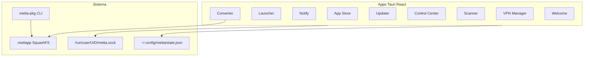

# METTA OS 2.0 — Ecosistema de aplicaciones

## Arquitectura



## Stack

| Capa | Tecnología |
|------|------------|
| UI | React 18 + TypeScript + Vite |
| Sistema | Tauri 2 (Rust) |
| Estilos | `usr/share/metta/metta-theme.css` |
| Paquetes propios | `.mettapp` (SquashFS) vía `metta-pkg` |

## Build

```bash
# 1. Assets (wallpaper, sonidos, frames Plymouth)
./scripts/generate-assets.sh

# 2. Apps Tauri → includes.chroot/usr/bin/
METTA_BUILD_APPS=1 ./apps/build-all.sh

# 3. ISO live
./scripts/ci-build.sh
```

En CI, activa `METTA_BUILD_APPS=1` para compilar binarios nativos. Sin eso, la ISO usa stubs (`/usr/lib/metta/app-stub.sh`).

## Formato .mettapp

Ver `kali-config/common/includes.chroot/usr/lib/metta/metta-pkg` y `scripts/metta-pkg-pack.sh`.

## Apps

| Binario | Directorio |
|---------|------------|
| `metta-control-center` | `apps/metta-control-center/` |
| `metta-launcher` | `apps/metta-launcher/` |
| `metta-notify` | `apps/metta-notify/` |
| `metta-scanner` | `apps/metta-scanner/` |
| `metta-app-store` | `apps/metta-app-store/` |
| `metta-updater` | `apps/metta-updater/` |
| `metta-converter` | `apps/metta-converter/` |
| `metta-vpn-manager` | `apps/metta-vpn-manager/` |
| `metta-netmap` | `apps/metta-netmap/` |
| `metta-welcome` | `apps/metta-welcome/` |

Scaffold nueva app: `./apps/scaffold-app.sh metta-nueva-app "METTA Nueva App"`

## Integración live

- Hooks: `0095` (Picom), `0160` (v2 desktop), `0150`/`0990` (Xfce)
- Paquetes extra: `kali-config/common/package-lists/metta.list.chroot`
- Calamares: `etc/calamares/branding/metta/`

## Darling (macOS .app)

Experimental. Si no está en repos Kali, compila y coloca `.deb` en `packages/`. El Converter muestra aviso al detectar `.app`.
